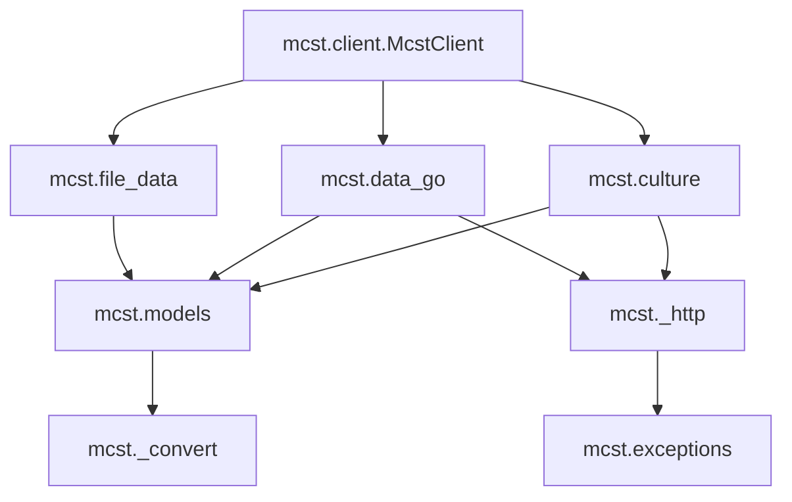

# ARCHITECTURE — python-mcst-api 아키텍처 가이드

본 문서는 `mcst` 라이브러리의 핵심 아키텍처 설계 원칙과 패키지 레이아웃을 상세히 기록합니다. 이 문서를 통해 라이브러리의 구조를 이해하고 일관성 있게 확장할 수 있습니다.

---

## 1. 패키지 의존성 및 흐름

이 라이브러리는 최소한의 의존성인 **`httpx`** (HTTP 통신)와 **`pydantic`** (데이터 무결성 및 타입 파싱)을 기반으로 구축되었습니다. 

패키지 내부 모듈 간의 의존 방향은 엄격히 **단방향(Acyclic)**으로 흐릅니다:



### 핵심 모듈의 책임 경계:
- **`mcst.catalog`**: 지원하는 공공 데이터셋 및 OpenAPI 엔드포인트의 한국어 공식 용어, 메타데이터 정보가 기술된 유일한 기준입니다.
- **`mcst._http`**: 모든 공공 데이터망과의 HTTP 통신을 관장하는 공통 비동기 세션 엔진입니다. 재시도 가드, 타임아웃, 예외 추상화를 보장합니다.
- **`mcst.models`**: Pydantic v2 기반의 엄격하게 타이핑된 데이터 스키마 정의 모음입니다.
- **`mcst.culture` & `mcst.data_go`**: 각각 문화정보원(KCISA) 및 공공데이터포털(ODCloud) OpenAPI 통신을 처리하는 전용 어댑터 레이어입니다.
- **`mcst.client`**: 소비자가 단일 진입점으로 전체 클라이언트들을 손쉽게 사용할 수 있도록 편의를 제공하는 최상위 퍼사드(Facade) 객체입니다.

---

## 2. Pydantic v2 데이터 모델링 원칙

본 라이브러리는 **Pydantic v2 (>=2.7)**를 표준으로 삼아 데이터 검증 및 파싱을 수행합니다. downstream의 IDE 개발 경험 극대화와 정적 검사 속도 개선을 위해 아래 설계를 준수합니다.

### 2.1 Pydantic v1.x/v2.x 호환 가이드
- **`BaseModel`** 과 **`Field`** 등은 Pydantic v2의 최신 네임스페이스(`pydantic.BaseModel`)로부터 직접 import하여 사용합니다.
- 호환성 저하를 방지하기 위해 구형 `v1` 네임스페이스(`pydantic.v1`)는 절대 사용하지 않습니다.
- 응답 데이터 변환 시 Zod v4 사상과 유사하게, 불필요한 필드들은 유연하게 무시하고 정의한 스키마에 필요한 필드만 정확히 매핑하여 downstream으로 전달합니다.

### 2.2 Zod와의 사상 동치성
- 타입 안정성이 깨지기 쉬운 한국 공공 API의 문자열 기반 값들(예: 날짜 `"2026-05-30"`, 정수 `"12345"` 등)은 모델의 `Field` 검증 단계 또는 `@field_validator` 데코레이터를 사용하여 정규 파이썬 객체(예: `datetime.date`, `int` 등)로 완전 타입 강제(Coercion)하여 파싱합니다.

---

## 3. 공공 OpenAPI의 특수성 및 `_http` 엔진 설계

대한민국 공공 API망은 런타임에 매우 빈번하게 오작동하거나 표준 HTTP 규약을 벗어납니다. `_http.py` 엔진은 이러한 변수들을 내부적으로 완벽히 격리하도록 설계되었습니다.

### 3.1 HTTP 200 성공 속의 애플리케이션 에러 판별
- 공공 API 서버들은 인증키 오류, 서비스 제공 한도 초과 등 명백한 시스템 장애 상황에서도 HTTP status **`200 OK`**와 함께 XML/JSON 응답을 날립니다.
- 이를 방지하기 위해 `_http` 엔진은 HTTP layer의 통과 여부와 상관없이, 응답 페이로드 내부의 `resultCode`나 `response.header.resultCode` 등의 값을 재귀적으로 분석하여 `"00"`(성공) 또는 `"SUCCESS"`가 아닌 경우 즉시 커스텀 예외(`McstError`)를 발생시킵니다.

### 3.2 비밀값 마스킹 (`Redaction`)
- API 키 오염과 노출은 보안상 매우 치명적입니다.
- `_http` 내부에서 발생하는 예외나 로깅 출력 전, 요청 URL에 삽입된 `serviceKey` 쿼리 파라미터나 API 헤더 값을 정규식 패턴을 이용해 `***`로 완전 마스킹 처리하여 로그에 남거나 예외 메시지로 버블업되지 않도록 차단합니다.

### 3.3 복원력 (Resilience)
- `httpx.AsyncClient` 빌드 시 자동으로 커스텀 `httpx.HTTPTransport` 또는 재시도 미들웨어를 탑재하여, 일시적인 네트워크 순식간 끊김(Transient Network Fault) 상황에 대응해 지수 백오프(Exponential Backoff) 기반의 3회 재시도를 보장합니다.

---

## 4. 오프라인 리플레이(Replay) 테스트 아키텍처

네트워크 연결이 없는 오프라인 격리 환경에서도 데이터 파서와 타입 강제 로직이 항상 정상 작동함을 보증하기 위해 **리플레이 테스트**를 핵심 구조로 채택합니다.

```
[로컬 디버그 도구 / DebugRun] (debug.py)
      │
      ├─► 실제 공공 서버망 호출 
      ├─► 획득한 실서버 Raw JSON을 tests/fixtures/에 정제 저장
      │
[pytest 오프라인 단위 테스트] (test_generated_fixtures.py)
      │
      ├─► tests/fixtures/*.json을 로컬에서 로드 (네트워크 0)
      ├─► mcst.replay.ReplaySession을 httpx Client에 주입
      └─► parse_response() 등을 가동하여 모델 정합성 및 타입 Coercion 정상 작동 여부 검증
```

이 구조 덕분에, 공공 서버망이 오프라인이거나 API 키가 없는 로컬 PC 환경에서도 90% 이상의 핵심 비즈니스 로직 테스트 커버리지를 안정적으로 유지할 수 있습니다.
